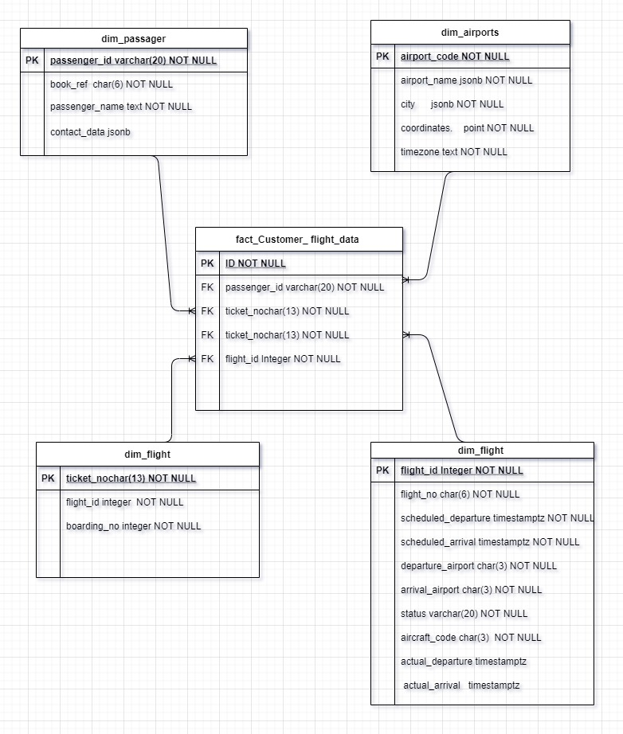

<!-- PROJECT LOGO -->
<br />
<p align="center">
  <a href="https://github.com/saboye/Data-Modeling-with-Postgrese">
    
  </a>

  <h3 align="center">Data Modeling with Postgres</h3>

  <p align="center">
    project description
    <br />
    <a href="https://github.com/saboye/Data-Modeling-with-Postgres"><strong>Explore the docs »</strong></a>
    <br />
    <br />
    <a href="https://github.com/saboye/Data-Modeling-with-Postgres">View Demo</a>
    ·
    <a href="https://github.com/saboye/Data-Modeling-with-Postgres/issues">Report Bug</a>
    ·
    <a href="https://github.com/saboye/Data-Modeling-with-Postgres/issues">Request Feature</a>
  </p>
</p>

# Table of contents
1. [About The Project](#About_The_Project)
2. [List of Tables](#List_of_Tables)
3. [Metadata](#Metadata)
4. [Fact and Dimensional tables](#Fact_and_Dimensional_tables)
5. [Installation](#Installation)
6. [License](#License)
7. [Contact]("#Contact")
8. [Acknowledgements](#Acknowledgements)


<!-- ABOUT THE PROJECT -->
## About The Project <a name="About_The_Project"></a>

In this project, I am creating a database schema using a Postgre Relational database. The project tasks need to define fact and dimension tables for a star schema for a particular analytic focus and answer the business questions using PostgreSQL.


<p>To see the online version of the entity relationship diagram (ERD) <a href="https://viewer.diagrams.net/?highlight=0000ff&edit=_blank&layers=1&nav=1&title=samuel.drawio#R7Z1tc9o6Fsc%2FDTO9L5LxAzbhZaDJ7e5NdjNt9%2B7tvskoWIAbY7O2SKCf%2Fkq2BNiSwAQsZOxOp8XC%2BEH%2Fo5%2BkoyOpYw9ny99jMJ8%2BRh4MOpbhLTv2545lmX3DxP%2BRlBVNMcx%2BljKJfY%2BmbRK%2B%2Bb8gO5GmLnwPJrkTURQFyJ%2FnE0dRGMIRyqWBOI7e86eNoyB%2F1zmYQC7h2wgEfOp%2FfQ9Ns9Qbx9ikf4H%2BZMrubBr0mxlgJ9OEZAq86D2XBJfoPgoRfcQnGM9ACEOEv3kE8SuMO87dFCHyprcd6x7%2FHZOzrydRNAkgmPvJ9Sia4eRRgk%2B5H4OZH5B83rrQgF4I386%2B69jDOIpQ9mm2HMKAiMVkyJ7pXvLtOh9ict0SPxheva0eXg0Ufnm3%2F0SPj5On3suVlV3lDQQLmr%2FAj%2BdRjJJnDyBAMwqtWO7jPJuTjwi8kKRBgkCMqJHYBk7AsiPgh%2FgN7c9mehwEYJ746elZytQPvAewihaIXYgdDcb%2BEnpfMxsh52JzecAXI4fk4iS3v9GHIV%2BDwJ%2BE%2BPMIZwG54yCGCX6WB5AgegafSTTf3mCM4HIriWba7zCaQRSv8Cn0267lZD%2BhJcZiBvW%2BMT%2BLmd902%2FT6NBFQe5qsr72RCX%2BgSh2gms2pJhUKvzryQfAVF0UQTlLN8pKQfPXiaP4dxBOIaMI88kmO3r3BrDCkme8HwTAKIqJsGIWQnZa%2BnDPAf%2FHrDo1rp%2BPgBxjiY3NzjP%2BS02M0jMIExdhCyK0gFuodErEGKJrT%2BwRwzB4jpplJPr9ECOGyJZN1p3Xv15pqa5eU1q5K2S6n7NMfh2gb4XcdBynVpr7nwTArkoTEYKO3QEph%2Fq%2FzvChGsSCW1MMurceWALbK%2FHdkPHwe4aoUf%2FOvf38n%2F%2F7n4aGzrkd0UoYhMTt3kMzByA8nD9kv3YJ0ThXSLeVFyVIppdtkSBoVQtI9NyR7RymrqCCWzH23dO6fC4k3UiSGYEaQ%2BDOJwpfO0Orc5uionSJ70XhyyXRBYb9FYTUo7J8bhaxXfhEs7JfO%2FnOx0DS57B75aJXBjzQIuQ9Ng2N5Dc8Ax3j8v9UfA%2FCz%2B88f3wKv%2F%2Fh26%2FlXlsl3uhqJR06zssSU4tG0FPJRIi7fo9Ow9JUSYJf1ngWRkgfiO16jKIo9PwQIJtc8IlOzvxxEnlRFfSB5XKerhaQcks75Icn38TQsf8cUr55ukOS7ZMifwV8kXywDvyAPRIpL7WSpFIsS3XTBIj8Qg%2FzRK8R8kulUr4GzPaLtbtnf0FynnHNEat04vFprCU8uly4N%2Fd0FzCwUsBPWeB8vivbOOqystJUVRL6Vf9i4mYIxMhGOP66HZq1%2Bvs2fgfA5jLKKazQF8SfT%2Fm3d6v9YU1%2BHETMlQu6o4RyVBUuXZv9hmtYAmaJRNKXIPK7NX0FBhJ7Prnd6XmrWAeCb%2Fy9R9PocwzEF5Aaa7m95Wh7cDzgHM5WIpwsjjxyEaSF50PiaUkgKBnwumZKZJeuDSdPisn8OkgSGExg%2F41%2BmLHwDcQpKyyiQslGMlEmnDSR1CVq9OEgKR9nUUvJYx0rNKCnR42yU5L0fG0qmQVopJ1OvctObkjLtdMGk27Ylq8KkaJxNKSbdZjUmXc0aky7fmEwHXUaIznWiwVqN4qFMJF14KIgmeYkAiSaZPKeVXDvUhr%2B56ebH2npdEetEc9R6lQlXD8%2BxloNtmdEfNtqmtMHJ%2B44vfLhNtwASYfwIHXDLD7XVxx9S7TjbB0JJ1AZhtQ3%2FqngpHGpTG%2B7VqIa%2FpVnDn%2BX2VvaPA3LftQuZFIwJbp1tjb3Vh5tqxNOGk60fuSpOCkfblGrbLD%2BypZkf2eL9yOu%2BNovjypGy2a5kmXzakFKXFRAuj5TiITel4h7rXqkZKiV6nA2VvAckgYD0vq%2FzQQndJsckyFTThpC8FyXrGOypzkSeZasZnuU15faSb5dq9HYba1%2Ffz%2Bnl7ycYtOsJ7lacMgICnCVkwukgWoRewlnK%2BkU%2Fbjzs%2FTSvXrV0cGcFT1q9nr12tXmHzYU7uG3NfDb2Lp%2BNZfyDdkPqVLdW69%2BWCahLXWu3fpuqcCkMbFGqbbP8NrZmfhub99tQVoYRThbOItGclWoE04WN1tHTDFo4yuBYur9Snbh8U%2BaS6UiNWR88WoKpB8loCr1FAL1nD5I8X8Tpuhv%2BDFsjmM3RrwbTUiqgLrg0b%2BoRW1ZHXJrmuXlp3jRrZjK1Zn14ad7wbtENL0Ec%2B%2FiLlpb75NOGlmxYv6Xl6WlZNs66QnWbFVtGrVkjWvb55v26TflMl0pnvXC7yb1wqXT6kLL1UVZGyt75SdksLyW1Zp1IKdhdJ2tN7uNkA6PLpPLpQ8s2vqwqWgr3mFNMy2YFmFFr1omWghAzBNAiSdMkS940EpSaR5mZfd6f0oLyRKA8%2B1zYNaobA0qJImcb3jF4DwhuTo5iMF7v2sgalYLFZxtJTImEuhDTMnifSkvMExHz%2FLNhjWPdLPUiJrVmnYjJe0LACC1wP1w6Gt4kPkoF04ePx%2B1q1fJxBx%2FPPwvWONaxUjc%2BOrrxUeD7SNuJlJJsDDy%2Fldk2LxvYqpTKqAs1u3yjkvUTEroCnESvBq0kZpqFbXts0RC3SDezOuHqMSyn5UyrrqQps2MpMbWFkm%2BKXvhMq65mw3JdwaicwH2Cqz5Yax9Kxdv4HD5ap3Snum47WFcVQ0UOFbUMbdZQXVezkbquIF45JeIM0zPYXlNs979bW8Wv%2BxRNjRWTaawNTtshvapwKvK%2FKMUpu1lTcKrZeJ4jCGhOWRjjHIb89vGFD8KVAWrRQFUjqy4EdfgGKVlBSSpSg9bcMc0yy7n3BWqZlW2d7NRjyp2WPhhn92JyotVuROJWVxQbt5y7o9mUO4dvTspCWOpXr1XreJFJuaOec1VK69bDea1lT2EPOEXr3igFp9usGSWuZp5rl%2Fdc00U4O5sQ6eICnLVAphrdtEFk65uuCpGi1W%2FUIrJZvmlXM9%2B0K%2FNNj%2FGb4KZliDPDx0a5BUyz0dsoywTUhZWCuSQvUfSKs6T%2BG%2BGRXzBb6eAsTP%2BcxqVSCGoRL5ko2NdwvWno6WcFHT1vpMEeFdkEhl0b5CndtVIwJ%2BXCXSrUnvWp%2BkzBJBKCyucYjjvbMS01Wxqz4m3yZDJqsyHs0bNHGtxb2MNN4dQgteI2y6NCjVknaIr2gMLQ9ADKzQlKnxE%2FYpaE%2F%2FtFMreBzhWphPoAs3WvVAVM4VwhteI2y79CjVknYPIeFhQhMkloFi3C9U5CRriYwdgffSLrqw6t35qJyg%2Bs1KG2NLVhfVWhUrxlnlJ1zWM9LnVjpWaRfebR2xzUn4AfWHlDaRkRxAIhf%2FQK0XO2pchhXmYdA%2FQq9DJ32Q66rD8tiNuzDUGRM93qBK1Hlaalm5mWhkMi94TyVldcXb5Ku3Q%2Fs6NbrebytRpFJts0m7qbP5k1W%2F%2B5YlezTMkdlaFo78%2Fq1oGwjm0wtuw8JHhPLTvXr9IcdlKD1oedFitQfHzKerPP9NCns3rayecH6aoLSU1BqKaOJNXSsbKPpIIYP9Wt0GYtWEWtWR%2BMmoIoywMC%2FGpBUEUS6kPMY3dBa4kp90ULNrlTjcxj3TJ1Q6ZEkbMhs8f37eiIHT9W19JSop42tLw5Nm6oGbTc7b5ea8aiG0R7gSqdPWLeHNtvqBkmMzvWB5OWVUIA6E0g69zi9%2FPR6isMAGl23m2%2BybrA2bCQiV9xMEWzgGYiDL3bOE4z8e4rFuV79AjCVWffWA25725Tx48ZLeIR3JXlbMwfsdIuO3N%2FqJ4pHNthiXGaKW%2F5RxYpRu%2FxROCwVTrdfOm0zYLo2avSX2105y5kFy5kFS%2BU5QR3odSA1i9%2BjE2V6C7W2qZYBu81qTI9ydaoyhlViUA49UYFlz76i%2F0Yf%2F5BapFrhx59XrJKhRys2EGIs%2BKv7YOtX5HDzc%2FSI%2Fa7U0KR%2Bev2WnCZzQ0qtWCn0GhxijO2ylqwa%2BYv1O0qtmCb75FUb8FZ0r0fsBOklsys8sq4Noxu3jT7e0wzPXrCfSqcSWkcyHbZ2JSHH1slRVw2TmnjLNSlhI2f18Rtq2Dixokg3VMNabtEANgZIK0UuMOrt9XDq4HCL%2B%2F2n%2BjxcfLUe7mySpqifeZGaK8wkbZbXHCsNG0LS5zZrBmuzBRLeAzq0V44IRPZKtF77bDEAlqV2mG%2FYIdm%2F4N2aBpFQyz2pSs3RC172HVtuLIt3PdacIlVpCu1YLfQbu0W7a6sBfd65zZgUc%2FLDYhT0vPfcobs%2Fn8RkXQEl%2BiKOrFv8Rk%2FFwnyx6vNCfjThP4fUA93KLwSsd%2BrJDV6cqHuzXzJX%2BU%2BDSbBR2Tioj0IX5J5%2Bq1Bl87An8j%2BLy8ggeyGOCuye%2BafAyen78RSC%2BWUvFe%2B4CUojl5hweMocEJyccvEfeiPQHBLv5j5npeW8vepj%2BC3OUjLwXsMyKvE0SL0oNfZBBFVFeFcoKUgAtYVef7NYpO1hIcSH8YR0XFjrfhtp4%2Fpqur23d8%3D">Click</a> here</p>


####  List of Tables <a name="List_of_Tables"></a>

 |     Name         |     Type      |  Small | Medium |   Big  | Description  |
 |----------------- |---------------|--------|--------|--------|--------------|
 | aircrafts        | table         |  16 kB |  16 kB |  16 kB | Aircraft     |
 | airports         | table         |  48 kB |  48 kB |  48 kB | Airports     |
 | boarding_passes  | table         |  31 MB | 102 MB | 427 MB | Boarding passes|
 | bookings         | table         |  13 MB |  30 MB | 105 MB | Bookings       |
 | flights          | table         |   3 MB |   6 MB |  19 MB | Flights        |
 | flights_v        | view          |   0 kb |   0 kB |   0 kB | Flights        |
 | routes           | mat. view     | 136 kB | 136 kB | 136 kB | Routes         |
 | seats            | table         |  88 kB |  88 kB |  88 kB | Seats          |
 | ticket_flights   | table         |  64 MB | 145 MB | 516 MB | Flight segments|
 | tickets          | table         |  47 MB | 107 MB | 381 MB | Tickets        |


### Metadata <a name="Metadata"></a>
##### Table bookings.aircrafts_data

| Column     |  Type   | Modifiers    |             Description |
|------------|---------|--------------|-------------------------- |
|aircraft_code | char(3) | NOT NULL     | Aircraft code, IATA|
|model         | text    | NOT NULL     | Aircraft model|
|range         | integer | NOT NULL     | Maximal flying distance, km|

##### Table bookings.airports
|  Column     |  Type   | Modifiers    |           Description|
| ------------| --------|--------------|-----------------------------|
|airport_code | char(3) | NOT NULL     | Airport code |
|airport_name | text    | NOT NULL     | Airport name |
|city         | text    | NOT NULL     | City |
|longitude    | float   | NOT NULL     | Airport coordinates: longitude |
|latitude     | float   | NOT NULL     | Airport coordinates: latitude |
|timezone     | text    | NOT NULL     | Airport time zone |

`The coordinates of the longitude and latitude have been transformed to point data type in the table. Here is the function to convert the longitude and latitude to point. `

```sh
--Return point with unknown SRID
SELECT ST_MakePoint(-71.1043443253471, 42.3150676015829);

--Return point marked as WGS 84 long lat
SELECT ST_SetSRID(ST_MakePoint(-71.1043443253471, 42.3150676015829),4326);

result
-------
1.5

For geodetic coordinates, X is longitude and Y is latitude
```
#### Table bookings.boarding_passes
 |  Column    |    Type    | Modifiers    |   Description|
 |----------- |------------|--------------|-------------------| 
 | ticket_no   | char(13)   | NOT NULL     | Ticket number|
 | flight_id   | integer    | NOT NULL     | Flight ID|
 | boarding_no | integer    | NOT NULL     | Boarding pass number|
 |  seat_no     | varchar(4) | NOT NULL     | Seat number |
 
 #### Table bookings.bookings
  |  Column     |      Type     | Modifiers    |         Description|
 |-------------|---------------|-------------- |---------------------------|
 | book_ref     | char(6)       | NOT NULL     | Booking number|
 | book_date    | timestamptz   | NOT NULL     | Booking date|
 | total_amount | numeric(10,2) | NOT NULL     | Total booking cost|
 
 
 #### Table bookings.flights
 |    Column      |     Type    | Modifiers    |         Description     |
|----------------|-------------|--------------|-------------------------|
| flight_id           | serial      | NOT NULL     | Flight ID|
| flight_no           | char(6)     | NOT NULL     | Flight number|
| scheduled_departure | timestamptz | NOT NULL     | Scheduled departure time|
| scheduled_arrival   | timestamptz | NOT NULL     | Scheduled arrival time|
| departure_airport   | char(3)     | NOT NULL     | Airport of departure|
| arrival_airport     | char(3)     | NOT NULL     | Airport of arrival|
| status              | varchar(20) | NOT NULL     | Flight status|
| aircraft_code       | char(3)     | NOT NULL     | Aircraft code, IATA|
| actual_departure    | timestamptz |              | Actual departure time |
| actual_arrival      | timestamptz |              | Actual arrival time|


#### Table bookings.seats
|      Column     |     Type    | Modifiers    |      Description  |
|-----------------|-------------|-------------|--------------------|
| aircraft_code   | char(3)     | NOT NULL     | Aircraft code, IATA
| seat_no         | varchar(4)  | NOT NULL     | Seat number|
|fare_conditions | varchar(10) | NOT NULL     | Travel class|


#### Table bookings.ticket_flights

|    Column      |     Type      | Modifiers    |    Description |
|-----------------|---------------|--------------|-----------------|
| ticket_no       | char(13)      | NOT NULL     | Ticket number |
| flight_id       | integer       | NOT NULL     | Flight ID  |
| fare_conditions | varchar(10)   | NOT NULL     | Travel class |
| amount          | numeric(10,2) | NOT NULL     | Travel cost |

#### Table bookings.tickets
|    Column     |     Type    | Modifiers    |          Description |
|--------------|------------|-------------|-------------------------|
| ticket_no      | char(13)    | NOT NULL     | Ticket number|
| book_ref       | char(6)     | NOT NULL     | Booking number|
| passenger_id   | varchar(20) | NOT NULL     | Passenger ID|
| passenger_name | text        | NOT NULL     | Passenger name|
| contact_data   | jsonb       |              | Passenger contact information|

<!-- GETTING STARTED -->
## Fact and Dimensional tables. <a name="Fact_and_Dimensional_tables"></a>
The following entity-relationship diagram shows a star schema optimized for queries created using the flight booking database. 


<p>To see the online version of the fact and dimensional entity relationship diagram (ERD) <a href="https://viewer.diagrams.net/?highlight=0000ff&edit=_blank&layers=1&nav=1&title=samsam.drawio#R7Z1bc6M4GoZ%2Fjat2LibFwfhw2XGSmdlNZrq6e2q798alGNlmGyOXkDtO%2F%2FqRQPJJwidACENVKmWEDEbvpwfx6kDHHS3Wv2GwnL8gH4Ydx%2FLXHfeh4zh213E67M%2Fy39OUvuWlCTMc%2BDzTNuFz8BPyRIunrgIfxnsZCUIhCZb7iRMURXBC9tIAxuhtP9sUhftnXYIZlBI%2BT0Aop%2F438Mk8TR141jb9dxjM5uLMtsX3LIDIzBPiOfDR214SXJMnFBH%2BEz9CvAARjAjd8wLwd4g73uOcEHalHzrOE%2F2bstx3M4RmIQTLIL6boAVNnsQ0y9MULIKQFfPOge75gejp3MeOO8IIkfTTYj2CIdNKyJD%2BpqeMvZtywOy4Z3zhLf7fh%2FFo8PzS%2FYz8b%2F%2F%2B6f%2F29eFXfpQfIFzx8vWDxXgJ4piWI%2BblRN5F4dMiW7KPBLyypPuYAEx4jDgeTaCqExBE9Kvug51shyFYxkGSPU2ZB6H%2FDN7RiogDia37abCG%2Fqc0RFheGi3P9GBs02K76cE%2F8x%2FDdoMwmEX084SWADvjPYYx%2FS3PICY8B786iAlcZxabvRGDVhqIFpDgd5plLepH%2Bg1eXUScvW1jjwZfmjbfjbsezwh4MM02R95qRD9wmS6QzJEky5SJXiUJQPiJ1kMQzRLF9gVhpepjtPwC8AwSnrBEASvPxx8wrQlJ0QdhOEIhYrpGKGJHImjJd4ZwKr77igihNYDLx4tjc9CkKLx7%2BkcLZ2TdeR2P%2FtwR3ba32%2FSPZcdkhKKYYBpN7BiQivoGmbDniZod7bLSXFrHO09atyxlXUnZj%2F%2B5TNsEuWCr7cWyWQeyHVY5RIt9GibUnAe%2BD6NcejhqPXYEEGWtpfy7UvkzEMKIknBMvzhyOh%2FoTjyZA%2Fwvx%2FqFZv3zry%2Fs%2F9%2FPzxXrJFCY5r2Pl2ASRLPn9Ju9AyE9XUKu9wXbrViezorl1QKZh5rWAJle1cjs5VS28IoI%2FUAcr3heembxsi8V%2FitC38cYTlNWpv8TXPYOaJnuN5yZWsQzhZG2%2FCjQQrIQSA7OhKRofxYvbd5HhnpR0s6Q4wQmyyt%2BuV2%2FbVdGYAFTGtLrJI2HZJZ2F1KyPC3lZ4SWkoVQ0rbPdFa6pd0B8z4m1AyT3aswWV7xy235xE2ckLEPCKB7%2Fh%2Bj6LVhPMwQ6UIeliea%2FAzADGQQYMaQOFMslYHsWp1bNJA9e99B7qo0U1Q0e1iaaANDbmIF3paUtXi34u450zkqZP%2FoXUxZIXU%2Bk9tDSdvLTGQVvzQYyzkUGVx1HytNAdGXuKMAx%2BF4gnx44Bpf1L7XpM3FZnLx4h25vzlaxTTFFakElVaZqOxVjUoh5ZXaaqqM15d%2FVrukMjDKPogAY%2BKCiAZ%2BYntc17NmCiCLF80YIJpigNweEIeVAzGfAWI%2BEK9zPMorb4XjEZB34fta8ocWkJkiGgNI2RFpAVkMIG2nckLmc07MJ2SGAJURUnYzJghhP4gAgfGdDMgk6BsOyAwNTQGkOHALyOIBqRqdrBWQbj6%2FxHhApgVnDiBd2cMgwQL%2BZKXipEMKDmF48aiC%2BiMxSzVjkCg7I6wXbRom586SqkF9aOLRWAw77SsUG6j60PqlSWaKD1LDaRhpuF%2FUh6YSt7zqKPsgNz4RwzXMGXFlZ4QEk%2B%2BQjCOUjCe23V%2FytPJN6DTTo%2BCxgSJaFTXFFqnhwLkTvFR1pOnlZd7xJPUaOOcaZpK4skmSthw3k9ZYxWDTeXdmZdSHm3rEM4WTYnRYy8nCOanqX9PKyW7ewST14mTXMK%2BkK3slrwgwM3lGm5UKUjZ7KkaWfMaQUjZNWlIWQ0plR5teVOa1V2qGygw9KkOlcVNhdMMvQxBj4CcbJDuO8fG7lXLxntv0jQ%2FnXpxtHLvHlOOn20b89nynVwvqK87mHJwMhLRIWBf3PVpFfixFy%2BZCcwRQPfwYI%2F3rtPJl3j2rv3nKfsyN%2B9ddwyyZ7jFLxrH%2B4E8Z7QJCpwQ05X4rTmY4Lo182DiBS%2BWKelq1bZYt4xlmy3iyLcNZGSGarFw%2ByHBW6hHMGDa2RkxZbBxUzsZm%2BTCeYT6MJ%2Fsw8WQO%2FVUI%2FbEPWYmvcDLSL1jQUASLJfnZZFIa7tp4eZcrbEmZaVkrlw%2FSKm5eR6VmqMzQozJUyqbHFpUA44DuaEF5QjxjQCn7Jy0oCwKlav0hraAU49WaAsqhWaDsKd75IFqSYuEu8dztNvq5O0M4UyDZk42TFpIFQfLsfsLSxM1rqtQLkmksGwRJ2ffgbchTiGzgSLEs8YwBZfv%2Bh7JA6ViVg7JZr4DoGfYOiJ7setDHa7KKk7SMd%2BU0kZFXvP5Bq46mrAl7g4ysfEJrL6%2BdUjNGGrYibF82PGgjcoLBdLMkrGhKinVsGg7Ly1eF1QrLvimrwt4gLCufzdrPa6vUC5Z9w1aJ7StWiZ2QFX3wzuzvbhIas%2BQyBo31WBellmisfAJr37hpQeWi0bBVUfoKqyNpHXJAil7u%2FVURd1HZwLZklojGAFM2UKbsnUejVUzLD%2BIx3cfHwyavQbp8bteNrgl2uCiYq7IiewopS9SyHiaKkZOq%2Bpe%2FWEclbnna5n2xTu0mVfUNs1FEU2dHgT8eOnUan1DuHKosvY7c6fTq17omZdFRZZpopeNANk2eqqZjqc8GA8Nsk8GxlwyLdcAyO%2BQM56Ye6YzhZGuhlMVJlYOil5Oyg3LjnDTMQxnc4MqyehQzBo%2F1WLmkjnhUrvull4%2Byg3LjfDRs5ZKBbHO0fDxLMVP4OJRtkpaPBfFRtVaJVj4OZQ%2FltvmYRrM5fBzKRkfdV3bSI5gxeDxjYg30Z1D4tPRqA%2FL%2BCYaABCh63O5J3dy0i82mV3w%2FJ4uQ1wEY%2BR8wTor08RMV7Qt6AdF7soNew1dRcdjGN7Zx54nNh%2FXuzod3sbUOyNdtTrr1TZyKft5%2BiW2I76SXxa4lU0GeFKMVnsAjhcbzEXEXuPTZYUdt21KovUnESTn%2F2P%2FFR9Zg%2FJi8728TXRtAiyEThysrplfKv7WNJOlA3YOFHDedi%2BJAaVFIBypqecbhGR5QiVGqjDbraLRdG9kFRql4jdbJMD3jplJqmLoH0dU7jK5rw9TTHaZnDAgyNEztysJUrN17mqannw3bMD0rTM%2BYI6Y7TI%2Ffu7c0vRsOe%2Fuh6pxqK7CtjxAHtNiS8T5FNwb658bv6T6ypscv3cQIkd3sGCznL8iHLMc%2F">Click</a> here</p>


## Installation <a name="Installation"></a>

1. Install Postgres from here 
    https://www.postgresql.org/download/

2. Clone the repo
   ```sh
   git clone https://github.com/saboye/Data-Modeling-with-Postgres.git
   ```
  
3. Importing the database using `psql` 
   ```sh
   psql -h localhost -d DATABASE -U postgres -f {FILE PATH}booking.sql
   ```


<!-- LICENSE -->
## License <a name="License"></a>

Distributed under the MIT License. See [LICENSE](https://github.com/saboye/Data-Modeling-with-Postgres/blob/master/LICENSE.txt) for more information.

<!-- CONTACT -->
## Contact <a name="Contact"></a>

Your Name - [@saboye](https://twitter.com/saboye1) - email

Project Link: [https://github.com/saboye/Data-Modeling-with-Postgres](https://github.com/saboye/Data-Modeling-with-Postgres)


<!-- ACKNOWLEDGEMENTS -->
## Acknowledgements <a name="Acknowledgements"></a>

* [https://www.postgresql.org/](https://www.postgresql.org/)
* [https://www.antwak.com/](https://www.antwak.com/)
* [https://postgrespro.com/docs/postgrespro/9.6/apjs04](https://postgrespro.com/docs/postgrespro/9.6/apjs04)
* [https://postgrespro.com/docs/postgrespro/9.6/apjs04](https://postgrespro.com/docs/postgrespro/9.6/apjs04)
* [https://www.postgresqltutorial.com/](https://www.postgresqltutorial.com/)
* [https://www.draw.io](https://www.draw.io/index.html)


