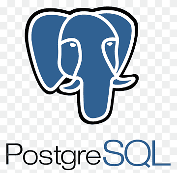
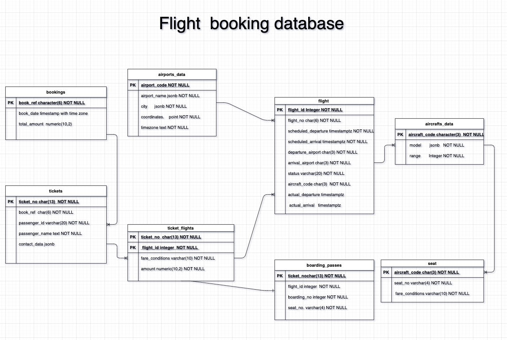

<!--
*** Thanks for checking out the Best-README-Template. If you have a suggestion
*** that would make this better, please fork the repo and create a pull request
*** or simply open an issue with the tag "enhancement".
*** Thanks again! Now go create something AMAZING! :D
***
***
***
*** To avoid retyping too much info. Do a search and replace for the following:
*** github_username, repo_name, twitter_handle, email, project_title, project_description
-->


<!-- PROJECT SHIELDS -->
<!--
*** I'm using markdown "reference style" links for readability.
*** Reference links are enclosed in brackets [ ] instead of parentheses ( ).
*** See the bottom of this document for the declaration of the reference variables
*** for contributors-url, forks-url, etc. This is an optional, concise syntax you may use.
*** https://www.markdownguide.org/basic-syntax/#reference-style-links
-->


<!-- PROJECT LOGO -->
<br />
<p align="center">
  <a href="https://github.com/saboye/Data-Modeling-with-Postgrese">
    
  </a>

  <h3 align="center">Data Modeling with Postgres</h3>

  <p align="center">
    project_description
    <br />
    <a href="https://github.com/saboye/Data-Modeling-with-Postgres"><strong>Explore the docs »</strong></a>
    <br />
    <br />
    <a href="https://github.com/saboye/Data-Modeling-with-Postgres">View Demo</a>
    ·
    <a href="https://github.com/saboye/Data-Modeling-with-Postgres/issues">Report Bug</a>
    ·
    <a href="https://github.com/saboye/Data-Modeling-with-Postgres/issues">Request Feature</a>
  </p>
</p>


<!-- TABLE OF CONTENTS -->
<details open="open">
  <summary><h2 style="display: inline-block">Table of Contents</h2></summary>
  <ol>
    <li>
      <a href="#about-the-project">About The Project</a>
      <ul>
        <li><a href="#built-with">Metadata</a></li>
      </ul>
      <ul>
        <li><a href="#built-with">Metadata</a></li>
      </ul>
    </li>
    <li>
      <a href="#getting-started">Getting Started</a>
      <ul>
         <li><a href="#installation">Installation</a></li>
      </ul>
    </li>
    <li><a href="#usage">Usage</a></li>
    <li><a href="#roadmap">Roadmap</a></li>
    <li><a href="#contributing">Contributing</a></li>
    <li><a href="#license">License</a></li>
    <li><a href="#contact">Contact</a></li>
    <li><a href="#acknowledgements">Acknowledgements</a></li>
  </ol>
</details>


<!-- ABOUT THE PROJECT -->
## About The Project

In this project, I am creating a database schema using a Postgre Relational database. The project tasks need to define fact and dimension tables for a star schema for a particular analytic focus and answer the business questions using PostgreSQL.



<p>The online version of the ERD <a href="https://viewer.diagrams.net/?highlight=0000ff&edit=_blank&layers=1&nav=1&title=samuel.drawio#R7Z1tc9o6Fsc%2FDTO9L5LxAzbhZaDJ7e5NdjNt9%2B7tvskoWIAbY7O2SKCf%2Fkq2BNiSwAQsZOxOp8XC%2BEH%2Fo5%2BkoyOpYw9ny99jMJ8%2BRh4MOpbhLTv2545lmX3DxP%2BRlBVNMcx%2BljKJfY%2BmbRK%2B%2Bb8gO5GmLnwPJrkTURQFyJ%2FnE0dRGMIRyqWBOI7e86eNoyB%2F1zmYQC7h2wgEfOp%2FfQ9Ns9Qbx9ikf4H%2BZMrubBr0mxlgJ9OEZAq86D2XBJfoPgoRfcQnGM9ACEOEv3kE8SuMO87dFCHyprcd6x7%2FHZOzrydRNAkgmPvJ9Sia4eRRgk%2B5H4OZH5B83rrQgF4I386%2B69jDOIpQ9mm2HMKAiMVkyJ7pXvLtOh9ict0SPxheva0eXg0Ufnm3%2F0SPj5On3suVlV3lDQQLmr%2FAj%2BdRjJJnDyBAMwqtWO7jPJuTjwi8kKRBgkCMqJHYBk7AsiPgh%2FgN7c9mehwEYJ746elZytQPvAewihaIXYgdDcb%2BEnpfMxsh52JzecAXI4fk4iS3v9GHIV%2BDwJ%2BE%2BPMIZwG54yCGCX6WB5AgegafSTTf3mCM4HIriWba7zCaQRSv8Cn0267lZD%2BhJcZiBvW%2BMT%2BLmd902%2FT6NBFQe5qsr72RCX%2BgSh2gms2pJhUKvzryQfAVF0UQTlLN8pKQfPXiaP4dxBOIaMI88kmO3r3BrDCkme8HwTAKIqJsGIWQnZa%2BnDPAf%2FHrDo1rp%2BPgBxjiY3NzjP%2BS02M0jMIExdhCyK0gFuodErEGKJrT%2BwRwzB4jpplJPr9ECOGyJZN1p3Xv15pqa5eU1q5K2S6n7NMfh2gb4XcdBynVpr7nwTArkoTEYKO3QEph%2Fq%2FzvChGsSCW1MMurceWALbK%2FHdkPHwe4aoUf%2FOvf38n%2F%2F7n4aGzrkd0UoYhMTt3kMzByA8nD9kv3YJ0ThXSLeVFyVIppdtkSBoVQtI9NyR7RymrqCCWzH23dO6fC4k3UiSGYEaQ%2BDOJwpfO0Orc5uionSJ70XhyyXRBYb9FYTUo7J8bhaxXfhEs7JfO%2FnOx0DS57B75aJXBjzQIuQ9Ng2N5Dc8Ax3j8v9UfA%2FCz%2B88f3wKv%2F%2Fh26%2FlXlsl3uhqJR06zssSU4tG0FPJRIi7fo9Ow9JUSYJf1ngWRkgfiO16jKIo9PwQIJtc8IlOzvxxEnlRFfSB5XKerhaQcks75Icn38TQsf8cUr55ukOS7ZMifwV8kXywDvyAPRIpL7WSpFIsS3XTBIj8Qg%2FzRK8R8kulUr4GzPaLtbtnf0FynnHNEat04vFprCU8uly4N%2Fd0FzCwUsBPWeB8vivbOOqystJUVRL6Vf9i4mYIxMhGOP66HZq1%2Bvs2fgfA5jLKKazQF8SfT%2Fm3d6v9YU1%2BHETMlQu6o4RyVBUuXZv9hmtYAmaJRNKXIPK7NX0FBhJ7Prnd6XmrWAeCb%2Fy9R9PocwzEF5Aaa7m95Wh7cDzgHM5WIpwsjjxyEaSF50PiaUkgKBnwumZKZJeuDSdPisn8OkgSGExg%2F41%2BmLHwDcQpKyyiQslGMlEmnDSR1CVq9OEgKR9nUUvJYx0rNKCnR42yU5L0fG0qmQVopJ1OvctObkjLtdMGk27Ylq8KkaJxNKSbdZjUmXc0aky7fmEwHXUaIznWiwVqN4qFMJF14KIgmeYkAiSaZPKeVXDvUhr%2B56ebH2npdEetEc9R6lQlXD8%2BxloNtmdEfNtqmtMHJ%2B44vfLhNtwASYfwIHXDLD7XVxx9S7TjbB0JJ1AZhtQ3%2FqngpHGpTG%2B7VqIa%2FpVnDn%2BX2VvaPA3LftQuZFIwJbp1tjb3Vh5tqxNOGk60fuSpOCkfblGrbLD%2BypZkf2eL9yOu%2BNovjypGy2a5kmXzakFKXFRAuj5TiITel4h7rXqkZKiV6nA2VvAckgYD0vq%2FzQQndJsckyFTThpC8FyXrGOypzkSeZasZnuU15faSb5dq9HYba1%2Ffz%2Bnl7ycYtOsJ7lacMgICnCVkwukgWoRewlnK%2BkU%2Fbjzs%2FTSvXrV0cGcFT1q9nr12tXmHzYU7uG3NfDb2Lp%2BNZfyDdkPqVLdW69%2BWCahLXWu3fpuqcCkMbFGqbbP8NrZmfhub99tQVoYRThbOItGclWoE04WN1tHTDFo4yuBYur9Snbh8U%2BaS6UiNWR88WoKpB8loCr1FAL1nD5I8X8Tpuhv%2BDFsjmM3RrwbTUiqgLrg0b%2BoRW1ZHXJrmuXlp3jRrZjK1Zn14ad7wbtENL0Ec%2B%2FiLlpb75NOGlmxYv6Xl6WlZNs66QnWbFVtGrVkjWvb55v26TflMl0pnvXC7yb1wqXT6kLL1UVZGyt75SdksLyW1Zp1IKdhdJ2tN7uNkA6PLpPLpQ8s2vqwqWgr3mFNMy2YFmFFr1omWghAzBNAiSdMkS940EpSaR5mZfd6f0oLyRKA8%2B1zYNaobA0qJImcb3jF4DwhuTo5iMF7v2sgalYLFZxtJTImEuhDTMnifSkvMExHz%2FLNhjWPdLPUiJrVmnYjJe0LACC1wP1w6Gt4kPkoF04ePx%2B1q1fJxBx%2FPPwvWONaxUjc%2BOrrxUeD7SNuJlJJsDDy%2Fldk2LxvYqpTKqAs1u3yjkvUTEroCnESvBq0kZpqFbXts0RC3SDezOuHqMSyn5UyrrqQps2MpMbWFkm%2BKXvhMq65mw3JdwaicwH2Cqz5Yax9Kxdv4HD5ap3Snum47WFcVQ0UOFbUMbdZQXVezkbquIF45JeIM0zPYXlNs979bW8Wv%2BxRNjRWTaawNTtshvapwKvK%2FKMUpu1lTcKrZeJ4jCGhOWRjjHIb89vGFD8KVAWrRQFUjqy4EdfgGKVlBSSpSg9bcMc0yy7n3BWqZlW2d7NRjyp2WPhhn92JyotVuROJWVxQbt5y7o9mUO4dvTspCWOpXr1XreJFJuaOec1VK69bDea1lT2EPOEXr3igFp9usGSWuZp5rl%2Fdc00U4O5sQ6eICnLVAphrdtEFk65uuCpGi1W%2FUIrJZvmlXM9%2B0K%2FNNj%2FGb4KZliDPDx0a5BUyz0dsoywTUhZWCuSQvUfSKs6T%2BG%2BGRXzBb6eAsTP%2BcxqVSCGoRL5ko2NdwvWno6WcFHT1vpMEeFdkEhl0b5CndtVIwJ%2BXCXSrUnvWp%2BkzBJBKCyucYjjvbMS01Wxqz4m3yZDJqsyHs0bNHGtxb2MNN4dQgteI2y6NCjVknaIr2gMLQ9ADKzQlKnxE%2FYpaE%2F%2FtFMreBzhWphPoAs3WvVAVM4VwhteI2y79CjVknYPIeFhQhMkloFi3C9U5CRriYwdgffSLrqw6t35qJyg%2Bs1KG2NLVhfVWhUrxlnlJ1zWM9LnVjpWaRfebR2xzUn4AfWHlDaRkRxAIhf%2FQK0XO2pchhXmYdA%2FQq9DJ32Q66rD8tiNuzDUGRM93qBK1Hlaalm5mWhkMi94TyVldcXb5Ku3Q%2Fs6NbrebytRpFJts0m7qbP5k1W%2F%2B5YlezTMkdlaFo78%2Fq1oGwjm0wtuw8JHhPLTvXr9IcdlKD1oedFitQfHzKerPP9NCns3rayecH6aoLSU1BqKaOJNXSsbKPpIIYP9Wt0GYtWEWtWR%2BMmoIoywMC%2FGpBUEUS6kPMY3dBa4kp90ULNrlTjcxj3TJ1Q6ZEkbMhs8f37eiIHT9W19JSop42tLw5Nm6oGbTc7b5ea8aiG0R7gSqdPWLeHNtvqBkmMzvWB5OWVUIA6E0g69zi9%2FPR6isMAGl23m2%2BybrA2bCQiV9xMEWzgGYiDL3bOE4z8e4rFuV79AjCVWffWA25725Tx48ZLeIR3JXlbMwfsdIuO3N%2FqJ4pHNthiXGaKW%2F5RxYpRu%2FxROCwVTrdfOm0zYLo2avSX2105y5kFy5kFS%2BU5QR3odSA1i9%2BjE2V6C7W2qZYBu81qTI9ydaoyhlViUA49UYFlz76i%2F0Yf%2F5BapFrhx59XrJKhRys2EGIs%2BKv7YOtX5HDzc%2FSI%2Fa7U0KR%2Bev2WnCZzQ0qtWCn0GhxijO2ylqwa%2BYv1O0qtmCb75FUb8FZ0r0fsBOklsys8sq4Noxu3jT7e0wzPXrCfSqcSWkcyHbZ2JSHH1slRVw2TmnjLNSlhI2f18Rtq2Dixokg3VMNabtEANgZIK0UuMOrt9XDq4HCL%2B%2F2n%2BjxcfLUe7mySpqifeZGaK8wkbZbXHCsNG0LS5zZrBmuzBRLeAzq0V44IRPZKtF77bDEAlqV2mG%2FYIdm%2F4N2aBpFQyz2pSs3RC172HVtuLIt3PdacIlVpCu1YLfQbu0W7a6sBfd65zZgUc%2FLDYhT0vPfcobs%2Fn8RkXQEl%2BiKOrFv8Rk%2FFwnyx6vNCfjThP4fUA93KLwSsd%2BrJDV6cqHuzXzJX%2BU%2BDSbBR2Tioj0IX5J5%2Bq1Bl87An8j%2BLy8ggeyGOCuye%2BafAyen78RSC%2BWUvFe%2B4CUojl5hweMocEJyccvEfeiPQHBLv5j5npeW8vepj%2BC3OUjLwXsMyKvE0SL0oNfZBBFVFeFcoKUgAtYVef7NYpO1hIcSH8YR0XFjrfhtp4%2Fpqur23d8%3D">Click</a> here</p>


####  List of Tables 

 |     Name         |     Type      |  Small | Medium |   Big  | Description  |
 |----------------- |---------------|--------|--------|--------|--------------|
 | aircrafts        | table         |  16 kB |  16 kB |  16 kB | Aircraft     |
 | airports         | table         |  48 kB |  48 kB |  48 kB | Airports     |
 | boarding_passes  | table         |  31 MB | 102 MB | 427 MB | Boarding passes|
 | bookings         | table         |  13 MB |  30 MB | 105 MB | Bookings       |
 | flights          | table         |   3 MB |   6 MB |  19 MB | Flights        |
 | flights_v        | view          |   0 kb |   0 kB |   0 kB | Flights        |
 | routes           | mat. view     | 136 kB | 136 kB | 136 kB | Routes         |
 | seats            | table         |  88 kB |  88 kB |  88 kB | Seats          |
 | ticket_flights   | table         |  64 MB | 145 MB | 516 MB | Flight segments|
 | tickets          | table         |  47 MB | 107 MB | 381 MB | Tickets        |


### Metadata
##### Table bookings.aircrafts_data

| Column     |  Type   | Modifiers    |             Description |
|------------|---------|--------------|-------------------------- |
|aircraft_code | char(3) | NOT NULL     | Aircraft code, IATA|
|model         | text    | NOT NULL     | Aircraft model|
|range         | integer | NOT NULL     | Maximal flying distance, km|

##### Table bookings.airports
|  Column     |  Type   | Modifiers    |           Description|
| ------------| --------|--------------|-----------------------------|
|airport_code | char(3) | NOT NULL     | Airport code |
|airport_name | text    | NOT NULL     | Airport name |
|city         | text    | NOT NULL     | City |
|longitude    | float   | NOT NULL     | Airport coordinates: longitude |
|latitude     | float   | NOT NULL     | Airport coordinates: latitude |
|timezone     | text    | NOT NULL     | Airport time zone |

`The coordinates of the longitude and latitude have been transformed to point data type in the table. Here is the function to convert the longitude and latitude to point. `

```sh
--Return point with unknown SRID
SELECT ST_MakePoint(-71.1043443253471, 42.3150676015829);

--Return point marked as WGS 84 long lat
SELECT ST_SetSRID(ST_MakePoint(-71.1043443253471, 42.3150676015829),4326);

result
-------
1.5

For geodetic coordinates, X is longitude and Y is latitude

```
<!-- GETTING STARTED -->
## Getting Started

To get a local copy up and running follow these simple steps.

### Prerequisites

This is an example of how to list things you need to use the software and how to install them.
* npm
  ```sh
  npm install npm@latest -g
  ```

### Installation

1. Install Postgres from here 
    https://www.postgresql.org/download/

2. Clone the repo
   ```sh
   git clone https://github.com/saboye/Data-Modeling-with-Postgres.git
   ```
  
3. Importing the database using `psql` 
   ```sh
   psql -h localhost -d DATABASE -U postgres -f {FILE PATH}booking.sql
   ```

<!-- USAGE EXAMPLES -->
## Usage

Use this space to show useful examples of how a project can be used. Additional screenshots, code examples and demos work well in this space. You may also link to more resources.

_For more examples, please refer to the [Documentation](https://example.com)_


<!-- ROADMAP -->
## Roadmap

See the [open issues](https://github.com/github_username/repo_name/issues) for a list of proposed features (and known issues).


<!-- CONTRIBUTING -->
## Contributing

Contributions are what make the open source community such an amazing place to be learn, inspire, and create. Any contributions you make are **greatly appreciated**.

1. Fork the Project
2. Create your Feature Branch (`git checkout -b feature/AmazingFeature`)
3. Commit your Changes (`git commit -m 'Add some AmazingFeature'`)
4. Push to the Branch (`git push origin feature/AmazingFeature`)
5. Open a Pull Request


<!-- LICENSE -->
## License

Distributed under the MIT License. See `LICENSE` for more information.


<!-- CONTACT -->
## Contact

Your Name - [@twitter_handle](https://twitter.com/twitter_handle) - email

Project Link: [https://github.com/github_username/repo_name](https://github.com/github_username/repo_name)


<!-- ACKNOWLEDGEMENTS -->
## Acknowledgements

* []()
* []()
* []()


<!-- MARKDOWN LINKS & IMAGES -->
<!-- https://www.markdownguide.org/basic-syntax/#reference-style-links -->
[contributors-shield]: https://img.shields.io/github/contributors/github_username/repo.svg?style=for-the-badge
[contributors-url]: https://github.com/github_username/repo_name/graphs/contributors
[forks-shield]: https://img.shields.io/github/forks/github_username/repo.svg?style=for-the-badge
[forks-url]: https://github.com/github_username/repo_name/network/members
[stars-shield]: https://img.shields.io/github/stars/github_username/repo.svg?style=for-the-badge
[stars-url]: https://github.com/github_username/repo_name/stargazers
[issues-shield]: https://img.shields.io/github/issues/github_username/repo.svg?style=for-the-badge
[issues-url]: https://github.com/github_username/repo_name/issues
[license-shield]: https://img.shields.io/github/license/github_username/repo.svg?style=for-the-badge
[license-url]: https://github.com/github_username/repo_name/blob/master/LICENSE.txt
[linkedin-shield]: https://img.shields.io/badge/-LinkedIn-black.svg?style=for-the-badge&logo=linkedin&colorB=555
[linkedin-url]: https://linkedin.com/in/github_username
